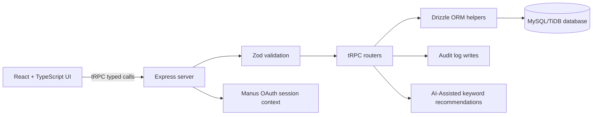

# MEDINEXUS 2.0 Architecture

MEDINEXUS uses a layered full-stack architecture. React renders the operations workspace and calls typed tRPC procedures. Express hosts the API and Vite development bridge. tRPC procedures validate inputs with Zod, invoke Drizzle query helpers, and persist records in MySQL/TiDB. The server context attaches the authenticated Manus OAuth user when a session exists.

The user experience is deliberately dashboard-oriented: a persistent navigation rail supports overview, patient, clinical, scheduling, pharmacy, capacity, and billing workflows. Backend-derived totals are rendered in the dashboard, while the Patient 360° view composes related records from multiple tables into one longitudinal profile.

The recommendation layer is deterministic and explainable. It maps submitted operational text to a small department queue using keyword rules and returns its rationale and educational disclaimer. It never claims to diagnose a disease or provide medical advice.
