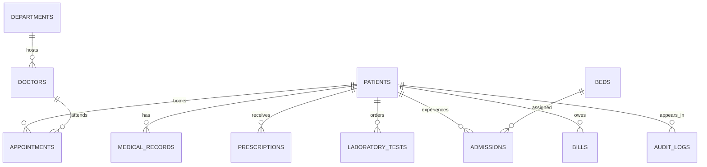

# MEDINEXUS 2.0 Database Design

The schema contains separate operational entities so the CRUD demonstration can be inspected table by table. The database uses surrogate integer keys, human-readable patient codes, timestamps for lifecycle events, and enum values for visible workflow states.

| Entity | Purpose | Important relationships |
|---|---|---|
| `patients` | Patient identity, contact, risk context, and status | Referenced by appointments, records, prescriptions, labs, admissions, and bills |
| `doctors` | Provider directory and availability | Referenced by appointments, records, and prescriptions |
| `departments` | Hospital service directory | Referenced by doctors and appointments |
| `appointments` | Scheduled care slots and conflict checks | References patients and optionally doctors/departments |
| `medical_records` | Consultation notes and clinical history | References patients and optionally doctors |
| `prescriptions` | Medicine instructions | References patients and optionally doctors |
| `laboratory_tests` | Ordered tests and results | References patients |
| `medicines` | Stock, reorder level, expiry, and status | Independent inventory table used by dashboard alerts |
| `beds` | Bed capacity and current occupancy | Optionally references the current patient |
| `admissions` | Patient bed assignment lifecycle | References patients and beds |
| `bills` | Charge amount, description, and payment status | References patients |
| `notifications` | Operational alerts | Independent queue displayed on overview |
| `audit_logs` | Activity trail for creates, updates, deletes, admission, and discharge | Stores entity and entity ID plus actor |
| `users` | OAuth identity and role | Supports session context and admin/user distinction |

