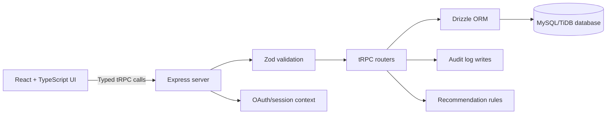

# MEDINEXUS 2.0
## AI-Assisted Smart Hospital Operations and Patient Care Management Platform

**Project Report**

**Project type:** Academic full-stack web application  
**Technology:** React, TypeScript, Express, tRPC, Drizzle ORM, MySQL/TiDB  
**Application preview:** `http://localhost:3001/`

> **Formatting note:** This report is divided into 15 page sections. When exporting to Word or PDF, insert a page break at each `PAGE BREAK` marker to preserve the intended 15-page structure.

---

## PAGE 1: TITLE PAGE

### MEDINEXUS 2.0
### AI-Assisted Smart Hospital Operations and Patient Care Management Platform

#### Submitted as an academic software project report

MEDINEXUS is a connected hospital operations workspace that supports patient registration, appointments, clinical coordination, pharmacy inventory, bed management, billing, notifications, audit logging, and role-based access control.

### Project summary

The project demonstrates how a modern web application can connect multiple hospital workflows through a shared database and typed API. It is designed for academic demonstration, software architecture review, and viva presentation.

### Academic disclaimer

This project is not a medical device or a clinical decision-support system. The recommendation feature is educational and rule-based. It does not diagnose illness, prescribe treatment, or replace a qualified healthcare professional. All seeded patient records are fictional.

**PAGE BREAK**

## PAGE 2: DECLARATION, ABSTRACT, AND KEYWORDS

### Declaration

MEDINEXUS has been developed as an academic software demonstration. The system focuses on the engineering of connected hospital workflows, secure application structure, and maintainable full-stack development. It is not intended for deployment with real patient data without additional clinical, legal, security, privacy, and compliance review.

### Abstract

Hospitals coordinate many activities at the same time: registering patients, managing appointments, updating clinical information, tracking medicines, assigning beds, and processing bills. When these activities are managed by disconnected tools, staff may spend additional time searching for information and confirming the current state of a workflow.

MEDINEXUS addresses this challenge through a centralized web application. Its dashboard gives authorized users a live operational overview, while dedicated workspaces support patient management, clinical coordination, scheduling, pharmacy inventory, admissions, and billing. A Patient 360° view connects related information into a longitudinal record.

The platform uses React and TypeScript on the frontend, Express and tRPC on the server, Zod for request validation, Drizzle ORM for persistence, and a MySQL/TiDB-compatible database. Authentication is represented through OAuth and signed session cookies, while server-side capabilities protect application procedures. A transparent keyword-based recommendation function demonstrates explainable automation without presenting itself as medical advice.

### Keywords

Hospital management, patient registry, healthcare workflow, appointment scheduling, inventory management, role-based access control, React, TypeScript, tRPC, Drizzle ORM, MySQL, full-stack web application.

**PAGE BREAK**

## PAGE 3: INTRODUCTION AND BACKGROUND

### 3.1 Background

Healthcare operations depend on accurate information moving between departments. A receptionist may register a patient, a clinician may review the patient's history, a scheduler may assign an appointment, pharmacy staff may issue medicine, and billing staff may record charges. Each activity affects the next one.

A system that treats these activities as isolated records can create duplicated information, delayed updates, and inconsistent operational status. A connected system can reduce this friction by maintaining relationships between patients, appointments, clinical records, prescriptions, admissions, inventory items, and bills.

### 3.2 Project motivation

The project was motivated by the need to demonstrate a realistic full-stack application rather than a collection of static screens. The application therefore includes server-side validation, database persistence, authenticated sessions, role permissions, audit events, transaction-oriented state changes, and a responsive dashboard interface.

### 3.3 Vision

The vision of MEDINEXUS is a calm, privacy-aware operations center that gives each authorized user the information needed for their role without exposing unrelated controls. The interface emphasizes scanning, clear status labels, connected workflows, and safe handling of records.

### 3.4 Academic value

The project combines frontend engineering, backend API design, database modeling, authentication, authorization, responsive design, testing, and documentation. This makes it suitable for demonstrating the complete software development lifecycle in one application.

**PAGE BREAK**

## PAGE 4: PROBLEM STATEMENT AND OBJECTIVES

### 4.1 Problem statement

Hospital departments often manage information across separate registers, spreadsheets, or applications. This can make it difficult to answer basic operational questions quickly:

- How many patients are currently registered?
- Which appointments are scheduled today?
- Which beds are available or occupied?
- Which medicines have reached their reorder level?
- What is the recent activity associated with a patient?
- Which user is authorized to modify a record?

MEDINEXUS provides one connected workspace for these questions while keeping security and data ownership on the server.

### 4.2 Primary objectives

1. Centralize patient and hospital operations in one application.
2. Provide role-aware access to operational workflows.
3. Support patient registration, search, update, and safe deactivation.
4. Manage appointment creation, editing, cancellation, and conflicts.
5. Display clinical directories and explainable department suggestions.
6. Track pharmacy stock, reorder levels, expiry information, and alerts.
7. Represent available, occupied, and maintenance bed states.
8. Connect billing records to patient operations.
9. Preserve audit information for important mutations.
10. Demonstrate a maintainable and testable full-stack architecture.

### 4.3 Success criteria

The project is successful when a user can start the application, authenticate or choose a local development demo role, review the dashboard, complete a patient workflow, schedule an appointment, inspect other operational modules, and validate the core behavior through automated checks.

**PAGE BREAK**

## PAGE 5: SCOPE AND REQUIREMENTS

### 5.1 In-scope functionality

The implemented scope includes a protected dashboard, patient registry, Patient 360° drawer, appointment scheduling, clinical directory, recommendation workflow, pharmacy inventory, bed and admission view, billing view, notifications, audit events, role-based permissions, demo authentication, responsive layout, report download, and invoice printing.

### 5.2 Out-of-scope functionality

The project does not attempt to provide a real electronic medical record, medical diagnosis, treatment planning, insurance claims processing, medical device integration, national health identity verification, or legally compliant production hosting.

### 5.3 Functional requirements

| ID | Requirement |
|---|---|
| FR-01 | The system shall display an operational dashboard for authorized users. |
| FR-02 | The system shall allow permitted staff to register and search patients. |
| FR-03 | The system shall show related patient activity in a Patient 360° view. |
| FR-04 | The system shall create, update, and cancel appointments. |
| FR-05 | The system shall reject protected appointment conflicts. |
| FR-06 | The system shall display doctors and departments. |
| FR-07 | The system shall track medicine stock and status. |
| FR-08 | The system shall display bed capacity and admission state. |
| FR-09 | The system shall display and manage billing records. |
| FR-10 | The system shall enforce permissions on the server. |

### 5.4 Non-functional requirements

The system should be responsive, maintainable, understandable during a viva, resilient to invalid input, privacy-aware, and usable on both desktop and narrow mobile screens. Important business rules must not rely only on frontend checks.

**PAGE BREAK**

## PAGE 6: SYSTEM ARCHITECTURE

### 6.1 Architectural overview

MEDINEXUS follows a layered full-stack architecture. The React interface presents views and captures user actions. Typed tRPC calls communicate with the Express server. Server procedures validate input, check capabilities, apply business rules, call database helpers, and return typed results.



### 6.2 Frontend layer

The frontend is organized around the main workspace in `client/src/pages/Home.tsx`. It uses reusable UI primitives, Lucide icons, responsive CSS, tables, forms, drawers, modal dialogs, charts, badges, and status indicators. Navigation is capability-driven so users see the areas permitted by their role.

### 6.3 API layer

The server exposes typed tRPC procedures. This provides a shared contract between frontend calls and backend handlers. Procedures cover authentication, dashboard totals, patients, appointments, doctors, departments, inventory, beds, billing, and recommendations.

### 6.4 Persistence layer

Drizzle ORM provides typed access to the relational schema. Database helpers keep persistence logic separate from UI code. Migrations define the database evolution path, while the seed script provides fictional demonstration records.

**PAGE BREAK**

## PAGE 7: DATABASE DESIGN AND DATA FLOW

### 7.1 Database purpose

The relational database stores operational entities and the relationships between them. A database-backed design ensures that changes made in one workflow can be reflected in another workflow instead of remaining as frontend-only state.

### 7.2 Core entities

The system includes entities for users, patients, doctors, departments, appointments, medical records, prescriptions, laboratory reports, medicines, beds, admissions, bills, notifications, and audit logs.

### 7.3 Example relationships

- A patient may have many appointments.
- An appointment may reference a patient and a doctor.
- A patient may have multiple clinical records.
- A prescription may be associated with a patient and medicine information.
- A bed may be available, occupied, or under maintenance.
- An admission links a patient and a bed during a state transition.
- A bill is connected to a patient and records a financial status.
- An audit event records an action performed against an entity.

### 7.4 Patient 360° data flow

When a permitted user opens a patient record, the application requests the patient profile and related records. The server composes appointments, clinical records, prescriptions, laboratory reports, bills, and activity into one response. The interface presents these areas through tabs so the user can inspect a longitudinal view without navigating across disconnected pages.

### 7.5 Data integrity

State-changing operations are handled on the server. Admission and discharge operations use transactional logic so a patient and bed do not become inconsistent. Appointment conflict checks also happen against persisted data rather than trusting only the browser.

**PAGE BREAK**

## PAGE 8: FUNCTIONAL MODULES I - DASHBOARD AND PATIENTS

### 8.1 Operations dashboard

The dashboard is the first operational view after successful access. It contains:

- Total patient count.
- Today's appointment count.
- Available and occupied bed totals.
- Low-stock medicine alerts.
- Registration pulse chart.
- Bed occupancy chart.
- Recent patient registrations.
- Critical notifications.

The dashboard is intended for rapid scanning. It summarizes current state without replacing the detailed workflow sections.

### 8.2 Patient registry

The patient registry supports registration, search, viewing, editing, and safe deactivation. The registration form accepts identity and contact details, demographics, blood group, allergies, medical history, emergency contact information, and address.

### 8.3 Patient 360° view

The Patient 360° drawer is one of the central features of the application. It displays a profile header, key patient attributes, activity history, clinical records, appointment information, billing information, prescriptions, and laboratory reports. A plain-text patient report can be downloaded for academic demonstration.

### 8.4 Safe record handling

Patient deletion is represented as deactivation rather than destructive hard deletion. This preserves historical context and better reflects the retention needs of an operational record system.

**PAGE BREAK**

## PAGE 9: FUNCTIONAL MODULES II - CLINICAL AND APPOINTMENTS

### 9.1 Clinical directory

The clinical workspace presents doctors and departments with their relevant information. Authorized administrative users can update directory records. The directory supports operational coordination without claiming to replace a clinical information system.

### 9.2 Explainable department suggestion

The recommendation tool accepts a short description such as symptoms or operational context. A deterministic keyword matcher maps the input to likely departments. The response includes suggested queues, a rationale, and a disclaimer.

The feature is intentionally explainable. A user can inspect why a queue was suggested, and the system does not claim to identify a disease or prescribe treatment. This makes the feature appropriate for demonstrating responsible automation in an academic project.

### 9.3 Appointment workflow

The appointment form captures the patient, doctor, date and time, reason, and priority. Users can edit scheduled appointments and cancel them while preserving the scheduling history.

### 9.4 Conflict handling

The backend checks whether a doctor already has a conflicting appointment inside the protected time window. If a conflict is found, the procedure rejects the request and the interface displays the returned error. This is stronger than a visual warning because the rule is enforced where the data is persisted.

### 9.5 Priority and status

Appointments support routine, urgent, and emergency priority values. Status values represent scheduled, checked-in, completed, or cancelled states. These values are shown with consistent status badges in the interface.

**PAGE BREAK**

## PAGE 10: FUNCTIONAL MODULES III - PHARMACY, BEDS, AND BILLING

### 10.1 Pharmacy inventory

The pharmacy workspace tracks medicine name, category, unit, quantity, reorder level, expiry date, and computed stock status. The dashboard highlights low-stock items, while the inventory table supports review and authorized updates.

### 10.2 Beds and admissions

The capacity view represents available, occupied, and maintenance beds. Each bed includes a number, ward, type, status, and optional current patient reference. This allows staff to understand capacity at a glance.

### 10.3 Admission and discharge consistency

Admissions and discharges affect more than one record. The backend uses transaction-oriented logic to update the relevant patient and bed state together. This reduces the risk of showing an available bed that is still associated with an admitted patient.

### 10.4 Billing

The billing section lists bill identifier, patient, description, amount, status, and issue date. Status values include pending, paid, and overdue. The page calculates a visible total and provides edit and deletion controls according to capability permissions.

### 10.5 Invoice printing

The application can open a printable invoice window from a billing record. This is a lightweight academic workflow suitable for browser printing or saving as a PDF. It is not a replacement for a certified accounting system.

**PAGE BREAK**

## PAGE 11: USER INTERFACE AND USER EXPERIENCE

### 11.1 Interface principles

The interface uses a persistent navigation rail, a clear top bar, consistent section headings, compact status badges, responsive tables, and action-oriented controls. The visual language uses a calm clinical palette with teal accents, muted surfaces, and clear alert colors.

### 11.2 Navigation

The sidebar contains Overview, Patients, Clinical, Appointments, Pharmacy, Beds & Admissions, and Billing. Navigation items are filtered by capabilities returned from the server. On smaller screens, the sidebar becomes a mobile drawer with an overlay.

### 11.3 Forms and dialogs

Patient registration, appointment scheduling, editing, and management actions use modal dialogs or dedicated table actions. Forms include required fields, select controls, date inputs, and clear cancel and submit actions.

### 11.4 Feedback and status

The interface uses toast notifications for successful mutations and errors. Loading states appear while secure data or records are being requested. Empty states explain what the user can do next instead of leaving a blank panel.

### 11.5 Responsive behavior

The layout adapts at smaller widths. Tables can scroll horizontally, cards collapse into single-column grids, the navigation becomes a drawer, and form fields move from two columns to one. These behaviors support presentation on laptops, tablets, and mobile-sized screens.

**PAGE BREAK**

## PAGE 12: SECURITY, AUTHENTICATION, AND AUTHORIZATION

### 12.1 Authentication

The application supports an OAuth-based authentication flow with a callback route. After successful identity exchange, the server creates or updates the local user record and issues a signed session token in a cookie. Local development also provides a demo login for academic walkthroughs.

### 12.2 Authorization

Authorization is based on capabilities rather than only on visual navigation. The server checks access to protected procedures, while the frontend hides navigation areas that are not available to the current user.

### 12.3 Roles

| Role | General responsibility |
|---|---|
| Admin | Full operational visibility and configuration access |
| Doctor | Clinical, patient, and appointment workflows |
| Receptionist | Registration, scheduling, admissions, and billing |
| Patient | Patient-facing care information |
| User | Restricted account with limited access |

### 12.4 Safety-oriented controls

- Patient deletion becomes safe deactivation.
- Appointment removal becomes cancellation.
- Important mutations write audit events.
- OAuth state includes a nonce to reduce callback forgery risk.
- Provider login reports a clear configuration error when the OAuth URL is absent.
- Development demo authentication is blocked in production mode.

### 12.5 Production requirements

Production use would require HTTPS, protected secrets, encrypted backups, stronger identity verification, formal access reviews, database hardening, monitoring, retention policies, privacy impact assessment, and healthcare compliance evaluation.

**PAGE BREAK**

## PAGE 13: IMPLEMENTATION, TESTING, AND VALIDATION

### 13.1 Implementation structure

| Area | Location |
|---|---|
| Frontend workspace | `client/src/pages/Home.tsx` |
| Visual system | `client/src/index.css` |
| API procedures | `server/routers.ts` |
| Database helpers | `server/db.ts` |
| Database schema | `drizzle/schema.ts` |
| Seed data | `server/seed.ts` |
| Automated tests | `server/*.test.ts` |
| Documentation | `docs/` |

### 13.2 Automated validation

The project provides the following commands:

```powershell
pnpm check
pnpm test
pnpm build
```

The test suite includes authentication logout behavior, recommendation behavior, and role permission behavior.

### 13.3 Manual acceptance checklist

- Start the development server.
- Open the dashboard.
- Use a development demo role.
- Review dashboard totals and notifications.
- Register, search, edit, and open a patient.
- Download a Patient 360° report.
- Create and update an appointment.
- Verify appointment conflict handling.
- Review clinical department recommendations.
- Inspect pharmacy stock states.
- Inspect available and occupied beds.
- Review billing records and print an invoice.
- Test the mobile navigation behavior.

### 13.4 Verified project state

The current workspace has passed the TypeScript check, automated tests, and production build. The local preview runs at `http://localhost:3001/`. The Admin Demo opens the dashboard with seeded records. The unresolved analytics placeholder script was removed from the local HTML entry point, and missing OAuth configuration no longer produces a startup error.

**PAGE BREAK**

## PAGE 14: RESULTS, LIMITATIONS, AND FUTURE WORK

### 14.1 Results achieved

The completed application demonstrates a functioning hospital operations workspace rather than a static prototype. It connects dashboard summaries to database queries, connects patient records to related workflows, and applies permissions and business rules on the server.

The project also demonstrates practical engineering decisions: safe deactivation instead of destructive deletion, cancellation instead of removal for appointments, transaction-oriented admission changes, clear disclaimers for automation, and responsive behavior for different viewport sizes.

### 14.2 Current limitations

- The recommendation engine is deterministic and rule-based.
- Real OAuth requires provider-specific environment variables.
- Seeded data is fictional and does not represent a production dataset.
- Automated coverage does not yet cover every database-backed mutation.
- Invoice printing and report download are intentionally lightweight.
- The application has not undergone medical, legal, privacy, or compliance certification.

### 14.3 Future enhancements

1. Add broader integration tests for all procedures.
2. Add role-specific patient portal screens.
3. Add appointment reminders and notification delivery.
4. Add richer audit history and administrative reporting.
5. Add CSV/PDF exports with access logging.
6. Add accessibility testing and keyboard navigation review.
7. Add database backup and monitoring guidance.
8. Add configurable departments, wards, and billing categories.
9. Add formal deployment documentation.
10. Conduct security and privacy review before any real-data use.

**PAGE BREAK**

## PAGE 15: CONCLUSION AND REFERENCES

### 15.1 Conclusion

MEDINEXUS demonstrates how hospital operations can be represented in a connected, role-aware web application. Its main strength is the relationship between workflows: patients connect to appointments, clinical records, prescriptions, laboratory reports, admissions, notifications, and billing, while the dashboard summarizes the current operational state.

The project combines a modern frontend with typed server procedures, validated inputs, relational persistence, capability-based access, audit-aware mutations, and responsive interaction patterns. It therefore provides a useful academic example of complete full-stack application development.

The system should remain clearly separated from real clinical use. Before deployment with real patient information, it would require formal clinical validation, privacy controls, security assessment, compliance review, stronger identity verification, and operational monitoring.

### 15.2 Final project outcome

The project outcome is a working academic demonstration of a smart hospital operations center with:

- A live operational dashboard.
- Patient registration and Patient 360° records.
- Appointment scheduling and conflict detection.
- Clinical directories and explainable routing suggestions.
- Pharmacy stock monitoring.
- Bed and admission state management.
- Billing and printable invoice workflow.
- Authentication and server-side role permissions.
- Audit-aware and safety-oriented record handling.
- Automated validation and production build support.

### 15.3 References and project documentation

1. MEDINEXUS project README: `README.md`
2. MEDINEXUS architecture documentation: `docs/architecture.md`
3. MEDINEXUS testing documentation: `docs/testing.md`
4. MEDINEXUS API documentation: `docs/api-documentation.md`
5. Database schema: `drizzle/schema.ts`
6. Server procedures: `server/routers.ts`
7. React documentation: `https://react.dev/`
8. TypeScript documentation: `https://www.typescriptlang.org/docs/`
9. Drizzle ORM documentation: `https://orm.drizzle.team/docs/`
10. Vitest documentation: `https://vitest.dev/`

### End of report
